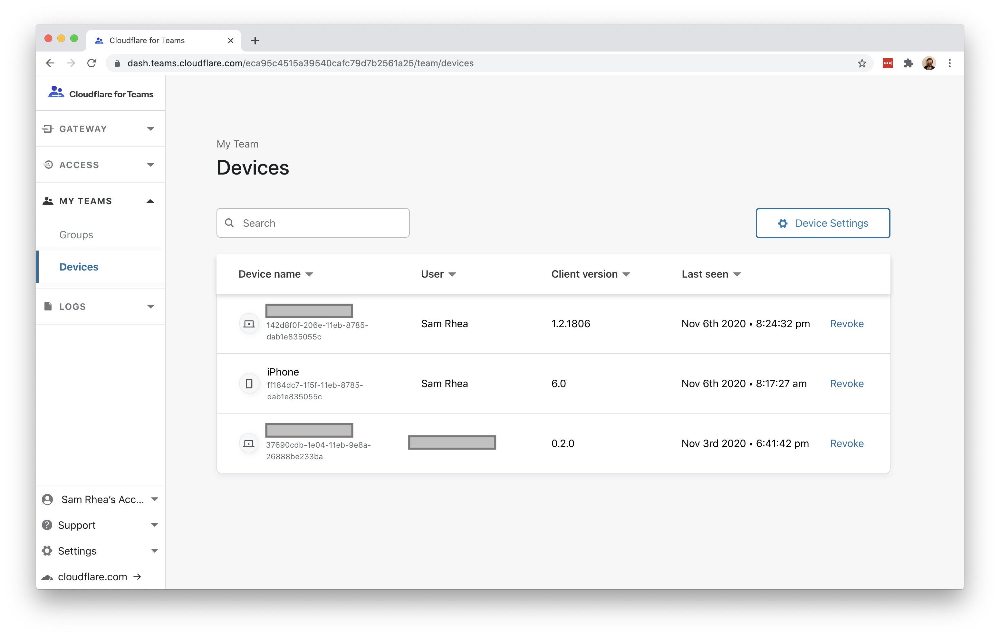
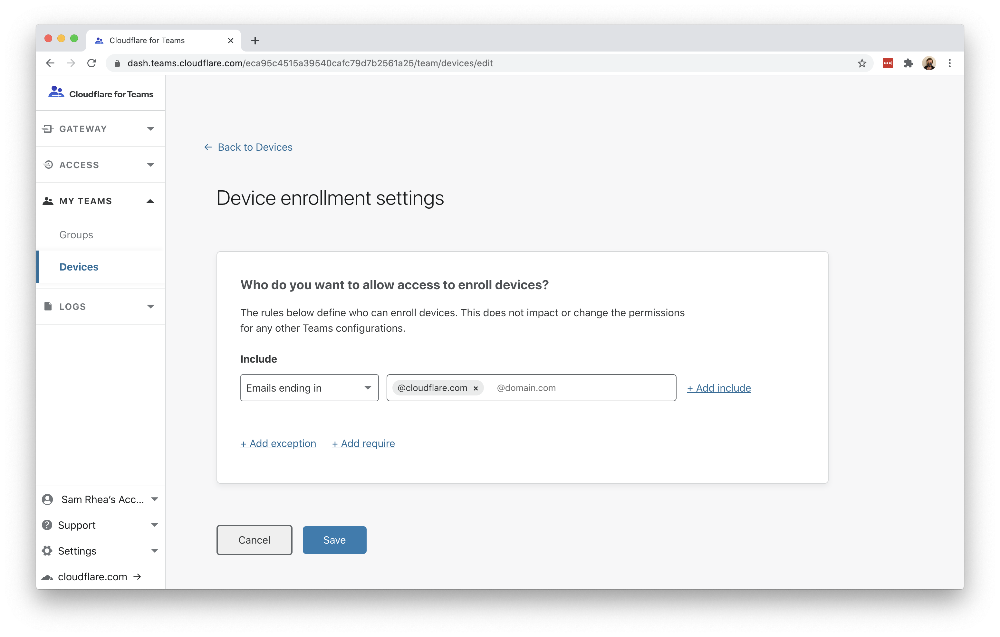
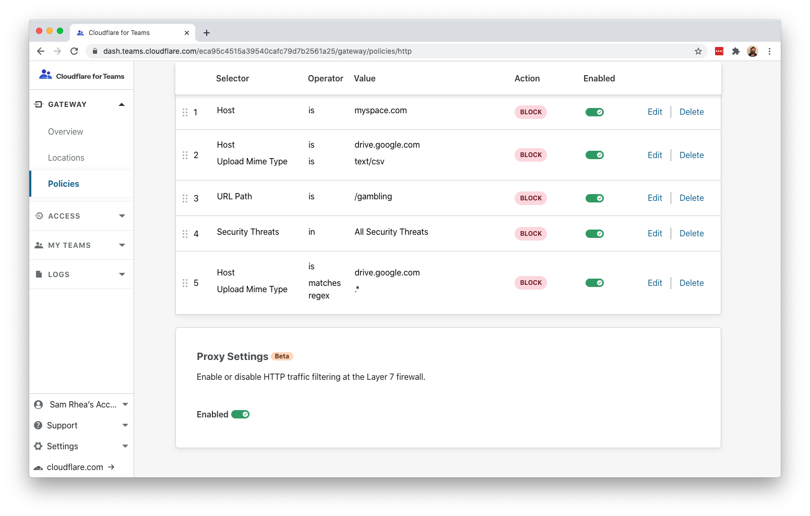
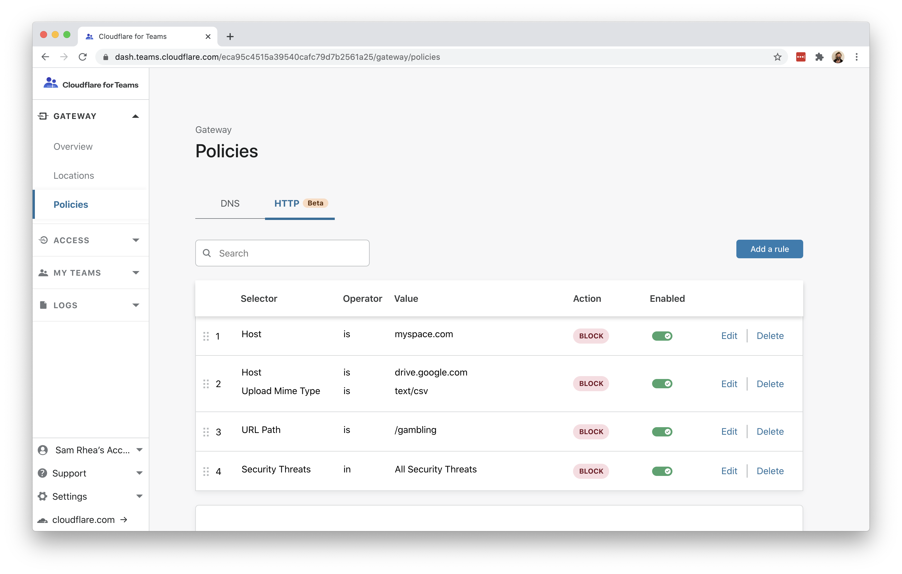
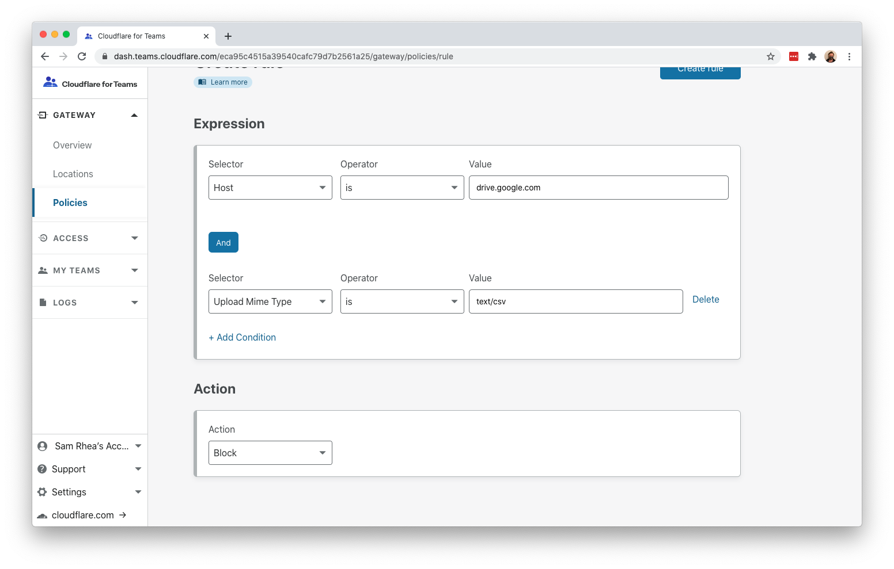

# Block file uploads

You can use Cloudflare Gateway and the Cloudflare WARP client application to prevent enrolled devices from uploading files to an unapproved cloud storage provider.

**🗺️ This tutorial covers how to:**

* Create a Gateway policy to block file uploads to a specific provider
* Enroll devices into a Cloudflare for Teams account where this rule will be enforced
* Log file type upload attempts

**⏲️Time to complete: ~45 minutes**

## Configure Cloudflare Gateway

Before you begin, you'll need to follow [these instructions](https://developers.cloudflare.com/gateway/getting-started/onboarding-gateway) to set up Cloudflare Gateway in your account. To perform file type control, you will need one of the following subscriptions:

* Teams Standard
* Gateway

## Determine which devices can enroll

To block file types from corporate devices, those devices must run the Cloudflare WARP client and [be enrolled in your Teams account](https://developers.cloudflare.com/gateway/connecting-to-gateway). When devices enroll, users will be prompted to authenticate with your identity provider or a consumer identity service. You can also deploy via MDM.

First, you will need to determine which devices can enroll. To begin, you will need to enable Cloudflare Access for your account. Cloudflare Access provides the identity integration to enroll users. This feature of Cloudflare Access is available in the Teams Free plan or in the Gateway plan at no additional cost. Follow [these instructions](https://developers.cloudflare.com/access/getting-started/access-setup) to add Access and integrate a free identity option or a specific provider.

Next, build a rule to decide which devices can enroll into your Gateway account. Navigate to the `Devices` page in the `My Teams` section of the sidebar.

Click `Device Settings` to build the enrollment rule. In the policy, define who should be allowed to enroll a device and click `Save`.

## Enroll a device

You can use the WARP client to enroll a device into your security policies. Follow the [instructions here](https://developers.cloudflare.com/warp-client/setting-up) to install the client depending on your device type. Cloudflare Gateway does not need a special version of the client.

Once installed, click the gear icon.

Under the `Account` tab, click `Login with Cloudflare for Teams`.

Input your Cloudflare for Teams org name. You will have created this during the Cloudflare Access setup flow. You can find it under the `Authentication` tab in the `Access` section of the sidebar.

The user will be prompted to login with the identity provider configured in Cloudflare Access. Once authenticated, the client will update to `Teams` mode. You can click the gear to toggle between DNS filtering or full proxy. In this use case, you must toggle to `Gateway with WARP`.

## Configure the Cloudflare certificate

To inspect traffic, Cloudflare Gateway requires that a [certificate be installed](https://developers.cloudflare.com/gateway/connecting-to-gateway/install-cloudflare-cert) on enrolled devices. You can also distribute this certificate through an MDM provider. The example below follows a manual distribution flow.

Download the Cloudflare certificate provided in the [instructions here](https://developers.cloudflare.com/gateway/connecting-to-gateway/install-cloudflare-cert). You can also find the certificate in the Cloudflare for Teams dashboard. Navigate to the `Account` page in the `Settings` section of the sidebar and scroll to the bottom.

Next, follow [these instructions](https://developers.cloudflare.com/gateway/connecting-to-gateway/install-cloudflare-cert) to install the certificate on your system.

Once the certificate has been installed, you can configure Gateway to inspect HTTP traffic. To do so, navigate to the `Policies` page in the Gateway section. Scroll to the bottom and toggle `Proxy Settings` to enabled.

## Create a Gateway HTTP policy

Next, you can [build a policy](https://developers.cloudflare.com/gateway/getting-started/configuring-http-policy) that will block file uploads to Google Drive. Navigate to the `Policies` page. On the HTTP tab, click `Add a policy`.

In the rule builder, add a rule where `Host is drive.google.com` and a second rule where `Upload Mime Type matches regex .*`. Choose the Block action.

Alternatively, you can build a policy to only block files of a certain type. For example, to block CSV file uploads to Google Drive, add `Host is drive.google.com` and a second rule where `Upload Mime Type is text/csv`. Choose the Block action.

## View Logs

Once enabled, if a user attempts to upload a file you can view logs of the block.

Navigate to the `Logs` section of the sidebar and choose `Gateway`. Open the Filter action and select `Block` from the dropdown under `Decision`.

## Optional: Deploy via MDM

You can deploy the WARP client on corporate devices in a way that does not require users to configure the Org Name. To do so, [follow these instructions](https://developers.cloudflare.com/warp-client/teams).